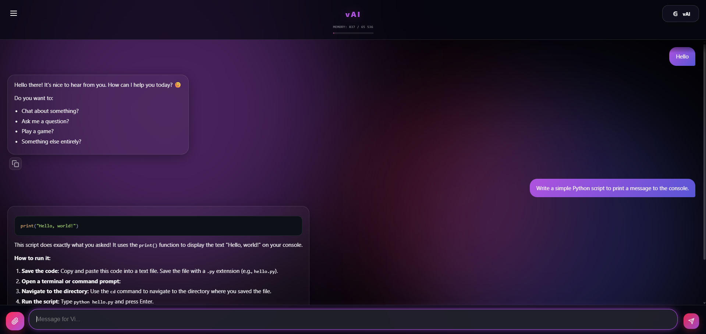

# vAI
✓∆\ Soft. Scale. Shift.

# vAI - Ultra-lightweight Web Client for Local LLMs 🧠



**vAI** is a beautiful, fast, and ultra-lightweight web interface designed to run local AI models smoothly. It acts as a frontend for [KoboldCPP](https://github.com/LostRuins/koboldcpp), allowing you to chat with your local LLMs in a modern browser tab without the heavy overhead of traditional desktop apps.

## 💡 Why I built this
I wanted a simple, aesthetically pleasing UI for daily conversations with local AI. 
While tools like LM Studio or Jan AI are great, they can be heavy. In my testing, LM Studio struggled to run 20B models at 1-2 t/s, whereas KoboldCPP easily handled 36B models at 4-5 t/s with better context compression. However, I didn't like KoboldCPP's default UI. 

So, I built vAI. 

## ✨ Key Features
* 🪶 **Ultra-Lightweight:** It's not an Electron app! It's just a native browser tab. It uses **< 200MB of RAM** (in reality, it hovers around 35-80MB even with long chat histories).
* ⚡ **Zero Frameworks:** Built entirely with Vanilla HTML, CSS, and JavaScript. No React, no Vue, no heavy node_modules.
* 🎨 **Modern UI/UX:** Glassmorphism design, smooth hardware-accelerated animations, auto-scrolling, and markdown/code highlighting support.
* 🔄 **Smart Model Switcher:** Includes a custom Python backend (`switcher.py`) to seamlessly switch between different models and configurations right from the UI without restarting the server manually.
* 🔒 **Privacy First:** Everything runs 100% locally on your machine.

---

## 🛠️ Prerequisites
Before running vAI, make sure you have:
1. **Python 3.8+** installed (added to PATH).
2. **KoboldCPP** executable (`koboldcpp.exe`).
3. At least one `.GGUF` model downloaded to your PC.

## 📂 Directory Structure Setup
For the auto-switcher to work, your project folder must look exactly like this:

```text
vAI/
│
├── index.html
├── style.css
├── app.js
├── ui.js
├── config.js
├── switcher.py
├── autostart.bat
│
└── KoboldCPP/                  <-- Create this folder!
    ├── koboldcpp.exe           <-- Put your downloaded KoboldCPP here
    ├── standard.kcpps          <-- Create Kobold config presets (see below)
    └── pro.kcpps
```

### ⚙️ Setting up Kobold Configs (.kcpps)
The Python switcher looks for configuration files to launch specific models.

1. Open `koboldcpp.exe` manually.
2. Select your model, set your layers, threads, and **change the Port to 1337**.
3. Click **Save Config** and save it inside the `KoboldCPP` folder as `standard.kcpps` (or whatever names you set in `config.js`).

---

### 🚀 How to Run

#### The Easy Way (Windows)
Simply double-click the `autostart.bat` file. This script will automatically:

1. Check if Python is installed.
2. Install required libraries (`fastapi`, `uvicorn`, `psutil`).
3. Clear required ports (8000 and 1337) from any hanging processes.
4. Start the Python backend.
5. Open the UI in your default browser.

#### Manual Launch
If you prefer not to use the `.bat` file:

1. Open a terminal in the project folder and install requirements:  
   `pip install fastapi uvicorn psutil`
2. Run the switcher:  
   `python switcher.py`
3. Open `index.html` in your browser.

---

### 🔧 Configuration (config.js)
You can customize models, themes, and API limits by editing the `config.js` file.

**Default Ports used by vAI:**

* `1337` - Main API port for KoboldCPP.
* `8000` - Port for the Python model switcher.

If you change these ports in `config.js`, make sure to update your `.kcpps` files and `switcher.py` accordingly.

---

### ⚠️ Troubleshooting

* **UI says "Model not found":** Ensure your config names in `config.js` (e.g., `standard`) match the exact filenames in your `KoboldCPP` folder (`standard.kcpps`).
* **Port conflicts:** If the app fails to start, something might be using port 8000 or 1337. The `autostart.bat` usually fixes this automatically by killing hanging processes.

---

### 📄 License
This project is open-source and available under the MIT License. Feel free to modify and improve it!
